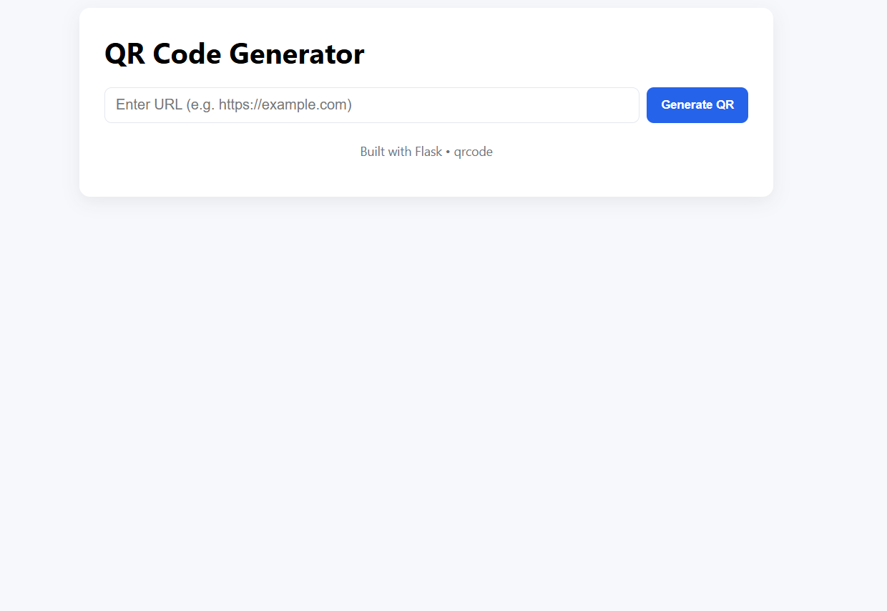
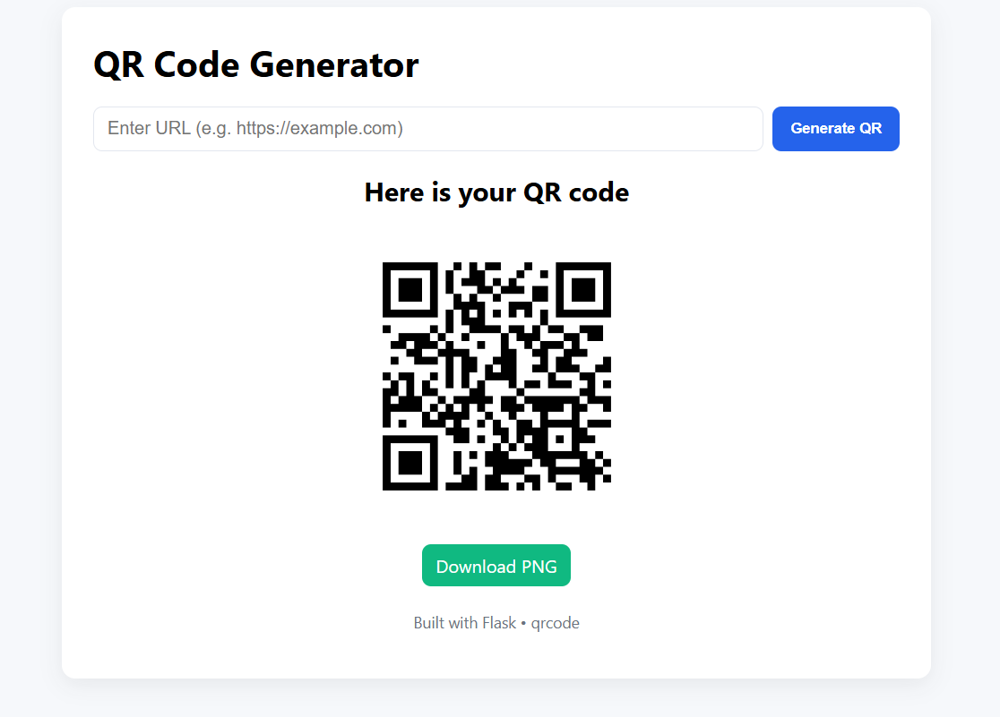

🚀 QR Code Generator – Flask Full-Stack Web App

A lightweight and user-friendly full-stack web application built using Flask, allowing users to generate QR codes instantly for any URL. The generated QR code is displayed on the page and can also be downloaded as a PNG file.

📌 Features

🔗 Enter any URL to generate a QR code

⚡ Instant QR image preview

⬇️ Download QR as PNG

🎨 Clean HTML/CSS UI

🧩 Fully backend-powered with Flask

📦 No database required

🖼️ Base64 embedding (no temporary files needed)

🛠️ Tech Stack
Backend

Python 3.x

Flask

qrcode (Pillow-based)

Frontend

HTML5

CSS3

Jinja2 Templates

📂 Project Structure
/project-folder
│── app.py
│── requirements.txt
│── /templates
│      └── index.html
│
└── /static
       └── style.css

▶️ Getting Started
1. Clone the Repository
git clone https://github.com/your-username/flask-qr-generator.git
cd flask-qr-generator

2. Create Virtual Environment (optional but recommended)
python -m venv venv

Activate:

Windows

venv\Scripts\activate

macOS/Linux

source venv/bin/activate

3. Install Dependencies
pip install -r requirements.txt

4. Run the Application
python app.py

5. Open in Browser
http://127.0.0.1:5000

🖥️ How It Works

User enters a URL into the form

Flask receives the input through POST

qrcode library generates a QR image in memory

Image is converted to Base64 and rendered in the template

User can view or download the QR code

📸 Screenshots (Optional)

You may add screenshots here:

🔧 Requirements

All dependencies are listed in requirements.txt:

Flask
qrcode[pil]

📜 License

This project is open-source. You may use, modify, or extend it freely. Add a specific license if needed (MIT recommended).

🤝 Contributing

Pull requests are welcome!
If you'd like to add new features like:

QR with logo

Multiple color themes

File upload (bulk QR generation)

Database integration

Feel free to suggest enhancements.

💡 Author

Developed by Nandha Kumar A P 
Feel free to reach out for improvements or collaborations!